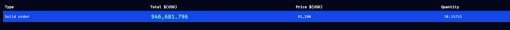

# Hi, thank you for reviewing, it was a fun challenge.

## How to run:

You can find it deployed on vercel here: [https://stream-them-all.vercel.app](https://stream-them-all.vercel.app/monitor)

If you decide to run it locally, you will first need to create an `.env` file in the root of the project with the following content:

```
VITE_CRYPTOCOMPARE_API_KEY=your_api_key
```

Then:

`npm install`

`npm run dev`

node version `22.2.0`

## Structure and Technologies:

Vite, React, React Router, Tailwind, Typescript, Zustand, React Window (for virtualization).

To control the stream I have created a zustand store that handles all of it -> `webSocketStore.ts`.

To hopefully help out with your reviewing, I have included some `console.log` + `console.error` code for the websocket connections,disconnections, reconnections, errors etc.

I have well accounted for server errors, heartbeats, keeping the stream in sync with CCSEQ and so on.

If you would like to test reconnection on missed heartbeats you can swap with this piece of code at `line 161` in `webSocketStore.ts`:

```
heartbeatIntervalId = setInterval(() => {
        if (Date.now() - get().lastHeartbeat > 1000) {
          console.warn("Stale connection: missing heartbeat. Reconnecting...");
          get().reconnect();
        }
      }, 500); // check every 0.5 seconds
```

Could the code be compartmentalized a bit more? Sure it could. I have componentized the code as much as as I could, and in places where actual value materializes. When it comes to the `webSocketStore.ts` code and for our case, I find it simpler to keep it in one place and not have to jump around files to understand what is going on.

## Process

### **Important**! Solid Alerts vs Big Alerts. Since most 10+ quantity orders are big alerts due to BTC price being too close to 100k, I have decided to not push solid alerts for orders with a total of over $1m even if the quantity is over 10. If I did, we would have a lot of duplicate alerts between big and solid. This of course means that depending on the price, solid alerts are rarely seen. They do exist though.



---

I went through the documentation of Order Book L2 and made a very close representation of their models/rules in `webSocketStore.types.ts`.

When it comes to memory leak, it was my biggest concern. I have tested it in a few ways and it's not present so far. I have consistently simulated a memory leak by inspecting dev tools and looking at the websocket incoming data. The browser stores it for debugging and as it is logical, the memory allocated grows and grows. By keeping the dev tools closed I haven't found any memory leaks thus far.

I implemented virtualization with `react-window` (removing dom elements that are not in viewport). While 500 is not a huge amount of data, that might change in the future. It's good to be prepared, the array still holds all 500 elements in memory.

When browser tab is not active/visible I am disconnecting from the connection. Reconnecting automatically when tab is in view can be enabled/disabled by the user.

## Shadow Banned:

I got shadow banned from CryptoCompare on my first attempt to stream the data, getting `429 Too Many Requests` error that just wouldn't go away. Making a second account from the same IP did not solve the problem, they did their due dilligence. Making a third account from a different IP did provide a working api key.

## Why is there no throttling?

I did implement throttling at first. UI/UX was much smoother and more performant on the Monitor page. The problem was that the data coming in the screen was just not up to date to the real data from the WS connection. Given this is a terminal app that displays **financial** data, and that I did not have any business requirements, I preferred to just remove all throttling logic and perhaps discuss it with you in the interview. I am quite curious myself of what is the best approach.

## What can be improved? What is missing?

- Keyboard navigation. I did not optimize for it.
- Show connection/error messages with toast notifications.
- Accessibility. There are no aria-labels or screen reader solutions. Not that it would make sense to have any.
- Mobile support, I have styled the app for desktop only, best viewed in 1080p+ screens.
- [Tailwind Merge](https://github.com/dcastil/tailwind-merge) for better readability and maintanability.
- Git history. It's okay, but I am using 1 branch for the whole project.
- I have not included any testing (vitest, jest, etc.).
- Are there any memory leaks I am not aware of?
